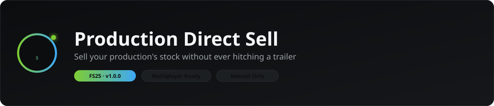
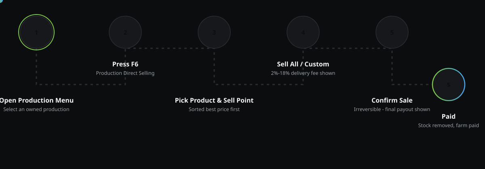
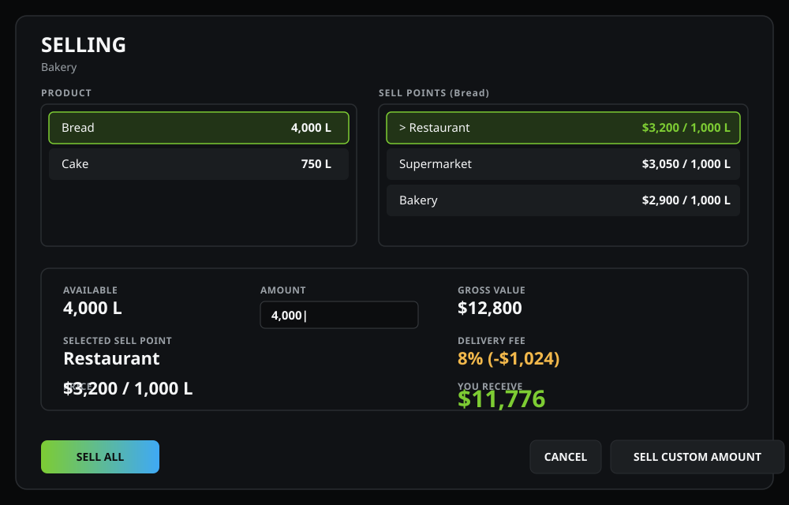

<div align="center">



<br/>

[](https://www.farming-simulator.com/)
[](#)
[](#multiplayer)
[](LICENSE)


</div>

## What is this?

**Production Direct Sell** adds one clean, focused feature to the vanilla **Production** menu: a way to sell whatever a production point currently has sitting in storage, remotely, without loading it onto a trailer and driving it to a sell point yourself.

It is a **manual** tool. Nothing is ever sold automatically, on a timer, or without your confirmation.

<div align="center">

</div>

## Features

- 🏭 **Lives inside the vanilla Production menu** — no separate standalone screen bolted onto the UI. Select a production you own, press the keybind, and the selling screen opens right there.
- ⌨️ **Configurable keybind** — *Production Direct Selling*, bound to **F6** by default, fully rebindable in `Options → Controls`, with proper multiplayer input handling.
- 📦 **Only shows what's actually in storage** — 0 L outputs and things the production merely *could* make are hidden. If it's not in the silo, it's not in the list.
- 💰 **Real, vanilla, live prices** — every number comes straight from the game's own `SellingStation:getEffectiveFillTypePrice()`. Market prices, seasonal swings, sell-point-specific price scales, price trends — all vanilla, all live. This mod never invents a fixed price and never touches the global economy system.
- 📊 **Sell points sorted best price → worst**, recalculated every time you open the screen — never a stale, hardcoded order.
- 🎲 **Randomised 2%–18% delivery fee** on every remote sale — this is instant, no-trailer-required delivery, so it costs a little more than doing it yourself. The fee is rolled once per product/sell-point choice and stays exactly where it is until you change the product, change the sell point, start a new transaction, or reopen the screen.
- 🧮 **Sell All** or **type a custom amount** — you can never sell more than what's actually stored.
- ✅ **A dedicated CONFIRM SALE step** before anything happens — product, amount, sell point, price, gross value, fee and final payout, all laid out clearly. Selling is irreversible, so nothing happens without this step.
- 🌐 **Full multiplayer support** — the client only *asks*; the server independently re-derives the production's owner, re-validates the sell point, re-reads the live price and clamps the fee before a single litre moves or a single coin changes hands.
- 🧩 **Self-contained and compatible** — no base-game files are modified, no global systems are overridden. Works with vanilla and modded productions/sell points as long as they use the standard `ProductionPoint` / `SellingStation` APIs.

## The screen

<div align="center">

</div>

*(Illustrative mockup built from the mod's own colour system — actual in-game rendering uses the real FS25 GUI framework.)*

## How to use it

1. Open the **Production** menu.
2. Select a production **you own**.
3. Press **F6** (*Production Direct Selling* — rebindable in `Options → Controls`).
4. Pick a **product** that's actually in storage.
5. Pick a **sell point** — they're sorted highest price first, and only sell points that actually accept that product are shown.
6. Click **Sell All**, or type a custom amount and click **Sell Custom Amount**.
7. Review **CONFIRM SALE** — product, amount, sell point, price, gross value, delivery fee, final payout.
8. Confirm. The product leaves storage, the fee is applied, and the payout lands in your farm's account.

No pallets spawn. No trailer is required. Your player character never moves. Nothing else on the production is touched.

## Multiplayer

Every sale is a two-step, server-authoritative round trip:

| | |
|---|---|
| **Client** | Sends the production point, the chosen product, the chosen sell point, the amount, and the fee it displayed to the player. |
| **Server** | Re-derives the production's real owner farm, confirms the fill type is a real output of that production, confirms the sell point genuinely accepts it, clamps the amount to what's actually in storage right now, **re-reads the live sell price itself**, clamps the fee back into the 2–18% range, then removes the stock and pays the correct farm. |

A player can never remotely sell another farm's production, the price can never be spoofed by a client, and the amount removed always matches the amount paid for.

## Compatibility

- ✅ Vanilla FS25 productions and sell points
- ✅ Modded productions and sell points that use the standard `ProductionPoint` / `SellingStation` base-game classes
- ✅ Multiplayer (dedicated and listen servers)
- 🚫 Does not modify or replace any base-game file
- 🚫 Does not add global overrides beyond appending one function on the vanilla Production menu frame

## Installation

1. Download `FS25_ProductionDirectSell.zip` from the [latest release](../../releases/latest).
2. Drop it, unmodified, into your `Farming Simulator 25\mods` folder (`Documents\My Games\FarmingSimulator2025\mods`).
3. Enable it in the in-game mod selector for your savegame.
4. Open a production you own from the Production menu and press **F6**.

## Project structure

```text
FS25_ProductionDirectSell/
├── modDesc.xml                       mod manifest, keybind + input action
├── icon_productionDirectSell.dds     ModHub icon
├── scripts/
│   ├── PDS_Main.lua                  entry point, menu hook, life cycle
│   ├── PDS_Manager.lua                product/sell-point lookup, pricing, server-side sale
│   └── PDS_SellRequestEvent.lua       client ⇄ server networking
├── gui/
│   ├── guiProfiles.xml                shared UI profiles
│   ├── PDS_SellingDialog.xml / .lua   the SELLING screen
│   └── PDS_ConfirmDialog.xml / .lua   the generic CONFIRM SALE / error dialog
└── l10n/
    └── l10n_en.xml                    all UI text
```

## Contributing

Issues and pull requests are welcome — in particular translations (copy `l10n/l10n_en.xml` to `l10n_<lang>.xml`) and reports of productions/sell points that don't behave as expected.

## License

[MIT](LICENSE)

---

<div align="center">
<sub>Not affiliated with GIANTS Software. Farming Simulator 25 is a trademark of GIANTS Software GmbH.</sub>
</div>
